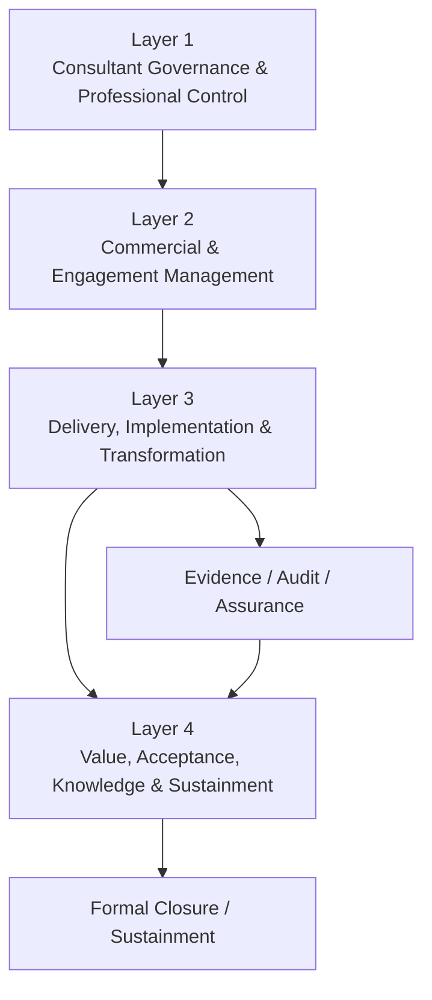

# Consultant v4.x — Professional Consultancy Management System & Operating Framework

> A public, GitHub-ready consulting governance and delivery framework for management-system, HR, labour, compliance, governance, risk, legal, knowledge-management, ESG, audit, and transformation assignments.

[](LICENSE)
[](CHANGELOG.md)
[](#repository-classification)
[](#source-classification)
[](#professional-use-notice)
[](#language)

## Overview

`/SKILL Consultant v4.x` is a **Professional Consultancy Management System & Operating Framework** designed to govern the full consulting lifecycle—from opportunity qualification and ethics through contracting, diagnosis, implementation, assurance, acceptance, benefits realization, knowledge transfer, formal closure, and sustainment.

The framework is deliberately broader than an ISO implementation checklist. It treats consulting as a governed professional service with explicit controls for:

- client and assignment fit;
- ethics, independence, and conflict of interest;
- consultant capability and assignment fit;
- engagement risk;
- scope, commercial, effort, fee, and economics control;
- evidence-based diagnosis and traceability;
- client decision governance;
- implementation and adoption;
- deliverable quality assurance;
- client acceptance and benefit realization;
- knowledge transfer and client self-sufficiency;
- consultant lessons learned, knowledge assets, and CPD.

## Repository classification

| Attribute | Value |
|---|---|
| Repository type | Public professional methodology / AI skill / consulting governance framework |
| Primary use | Management-system consulting, HR and labour compliance, governance, risk, audit, legal-support, KM, ESG and transformation |
| Intended users | Consultants, auditors, HR/compliance professionals, governance teams, trainers, researchers and AI agents |
| Operating model | Four-layer consultancy management system with Professional Gates 0–12 |
| Review model | AI-assisted or human-led professional work with human accountability for final professional decisions |
| License | MIT for original repository materials; third-party standards and sources retain their own rights |
| Current release line | v4.x |

## Four-layer architecture



### Layer 1 — Consultant Governance & Professional Control

Ethics, independence, conflict of interest, capability, CPD, engagement risk, confidentiality, IP, professional QA, senior review, independent review, methodology governance, knowledge assets and internal self-assessment.

### Layer 2 — Commercial & Engagement Management

Opportunity, client qualification, readiness, sponsor readiness, assignment acceptance, proposal/SOW, scope, assumptions, dependencies, governance, effort and fee estimation, engagement economics, decision rights, change control and re-contracting.

### Layer 3 — Delivery, Implementation & Transformation

Discovery, diagnosis, requirements, gap/maturity, process/control design, Requirement–Control–Evidence traceability, risk, KPI, implementation, change/adoption, evidence, internal audit, management review, corrective action and readiness.

### Layer 4 — Value, Acceptance, Knowledge & Sustainment

Deliverables, quality gates, client acceptance, benefits, self-sufficiency, handover, client satisfaction, knowledge transfer, lessons learned, reusable assets, closure and 30/60/90-day sustainment where applicable.

## Professional Consulting Gates 0–12

```text
Gate 0   Opportunity / Client Fit
Gate 1   Ethics / COI / Capability / Risk
Gate 2   Accept / Conditional Accept / Decline
Gate 3   Contracting / Scope / Acceptance Criteria
Gate 4   Diagnosis Complete
Gate 5   Client Decision / Solution Approval
Gate 6   Implementation Readiness
Gate 7   Evidence / Assurance Readiness
Gate 8   Deliverable Quality Gate
Gate 9   Client Acceptance
Gate 10  Benefits / Self-Sufficiency
Gate 11  Formal Closure
Gate 12  Sustainment Review, where applicable
```

See [`docs/PROFESSIONAL_GATES.md`](docs/PROFESSIONAL_GATES.md).

## Core operating principles

1. **Integrate before Create.**
2. **Understand before Recommend.**
3. **Contract before Commit.**
4. **Evidence before Conclusion.**
5. **Diagnose before Design.**
6. **Client Decision before Implementation** when a decision is required.
7. **Separate Recommendation from Client Decision.**
8. **Separate Deliverable from Outcome and Benefit.**
9. **Control Scope before Scope Controls the Assignment.**
10. **Protect Independence, Confidentiality and Professional Integrity.**
11. **Build Client Capability, not Consultant Dependency.**
12. **Capture Knowledge after Every Assignment.**
13. **Value must be demonstrable, not assumed.**
14. **Consultant owns consulting quality; the client retains ultimate business accountability unless the agreement states otherwise.**

## Source classification

Every material output should distinguish source provenance where applicable:

| Code | Meaning |
|---|---|
| `[STD]` | Standard-derived content |
| `[LAW]` | Legal or regulatory content |
| `[CLIENT]` | Client-specific or contractual requirement |
| `[CONS]` | Consultant recommendation, methodology, model or tool |
| `[DATA]` | Client or operational data |
| `[EVID]` | Objective evidence |

**Rule:** consultant-created scores, maturity levels, timelines, KPI, acceptance criteria, benefits models, readiness scales, fee calculations or tools must not be represented as ISO or statutory requirements unless the source expressly establishes them.

## Mandatory professional tools

- Client Qualification & Fit Assessment
- Client Readiness Assessment
- Sponsor Readiness Assessment
- Consultant Capability & Assignment Fit Matrix
- Conflict of Interest & Independence Register
- Engagement Risk Assessment
- Accept / Conditional Accept / Decline Decision
- Consultant Effort Estimator
- Fee & Pricing Estimator
- Engagement Economics Dashboard
- Assumption / Constraint / Dependency Register
- Executive Decision Paper
- Requirement–Control–Evidence Traceability Matrix
- Recommendation Tracking Register
- Deliverable Quality Gate
- Senior / Independent Review Record
- Client Self-Sufficiency Assessment
- Consultant Knowledge Asset Register
- Consultant Competency Passport
- Consultant CPD Register

## Repository structure

```text
.
├── README.md
├── SKILL.md
├── LICENSE
├── CITATION.cff
├── BRAND.md
├── SECURITY.md
├── CONTRIBUTING.md
├── CODE_OF_CONDUCT.md
├── SUPPORT.md
├── GOVERNANCE.md
├── DISCLAIMER.md
├── CONTEXT.md
├── AGENTS.md
├── CLAUDE.md
├── CHANGELOG.md
├── llms.txt
├── skills/
│   └── consultant-v4/
│       ├── SKILL.md
│       ├── references/
│       └── templates/
├── docs/
├── examples/
├── governance/
├── metadata/
├── assets/
└── .github/
    ├── CODEOWNERS
    ├── PULL_REQUEST_TEMPLATE.md
    └── ISSUE_TEMPLATE/
```

## Skill entry points

- Root compatibility entry: [`SKILL.md`](SKILL.md)
- Standard skill-library path: [`skills/consultant-v4/SKILL.md`](skills/consultant-v4/SKILL.md)
- Architecture: [`docs/ARCHITECTURE.md`](docs/ARCHITECTURE.md)
- Workbook architecture: [`docs/WORKBOOK_ARCHITECTURE.md`](docs/WORKBOOK_ARCHITECTURE.md)
- Source governance: [`docs/SOURCE_CLASSIFICATION.md`](docs/SOURCE_CLASSIFICATION.md)

## GitHub governance standard

This repository follows the `/SKILL std GitHub` operating model:

1. **Repository First** — repository structure and governance are established before feature expansion.
2. **No direct edits to `main`** for normal upgrades.
3. Create a branch named `version-X.Y[-scope]`.
4. Use **Conventional Commits**.
5. Run the repository QA checklist before opening a PR.
6. Open a PR with explicit scope, compatibility impact and validation result.
7. Prefer **squash merge** after approval.
8. Tag releases and maintain release notes / changelog.

See [`GOVERNANCE.md`](GOVERNANCE.md) and [`governance/REPOSITORY_QUALITY_STANDARD.md`](governance/REPOSITORY_QUALITY_STANDARD.md).

## AI and search discoverability

Machine-oriented discovery is supported through:

- [`llms.txt`](llms.txt)
- [`metadata/repository.json`](metadata/repository.json)
- [`metadata/skill-registry.yaml`](metadata/skill-registry.yaml)
- YAML frontmatter in the skill file
- descriptive headings, stable terminology and explicit keywords
- `CITATION.cff` for structured attribution

Primary search terms include:

`consulting framework`, `management consulting`, `consultancy management system`, `ISO consultant`, `management system implementation`, `HR consulting`, `labour compliance`, `audit`, `governance`, `risk`, `knowledge management`, `ESG`, `change management`, `benefits realization`, `ISO 20700`, `ISO 30201`.

## Professional use notice

This repository is a professional methodology and knowledge-support framework. It does **not** replace:

- the licensed text of an ISO or other copyrighted standard;
- professional legal advice;
- client-specific contractual review;
- competent human judgement;
- certification-body requirements or accreditation rules.

The repository does not reproduce the full text of ISO standards. Always validate conformity decisions against authorized sources applicable to the assignment.

## Language

The framework supports English and Thai professional use. Technical terms may be retained in English where this improves traceability across standards, audit records and international consulting practice.

## Versioning

Current release: **v4.0.0**.

- **Major** — architecture, scope or core operating-model change.
- **Minor** — new module, tool, adapter or substantive capability.
- **Patch** — correction, clarification, examples or non-breaking improvement.

See [`governance/VERSIONING.md`](governance/VERSIONING.md).

## Contributing

See [`CONTRIBUTING.md`](CONTRIBUTING.md). Contributions must preserve source classification, professional boundaries, copyright controls, and the separation between source-derived requirements and consultant-created methodology.

## License and third-party rights

Original repository materials are released under the [MIT License](LICENSE). Names, text and requirements from ISO and other third-party standards remain subject to their owners' copyright and trademark rights. See [`DISCLAIMER.md`](DISCLAIMER.md).

## Citation

See [`CITATION.cff`](CITATION.cff).
